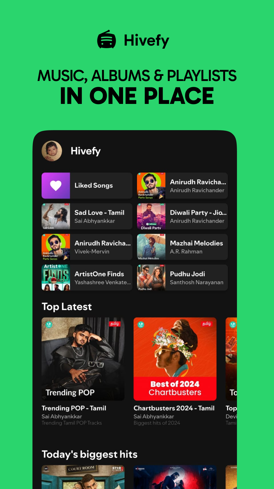
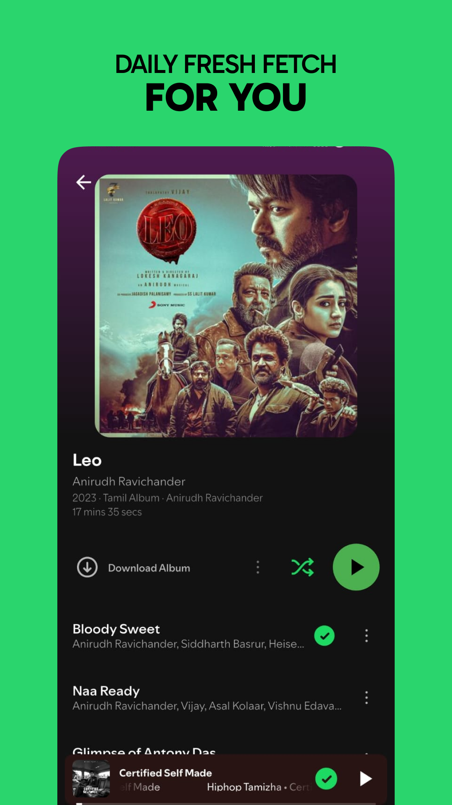
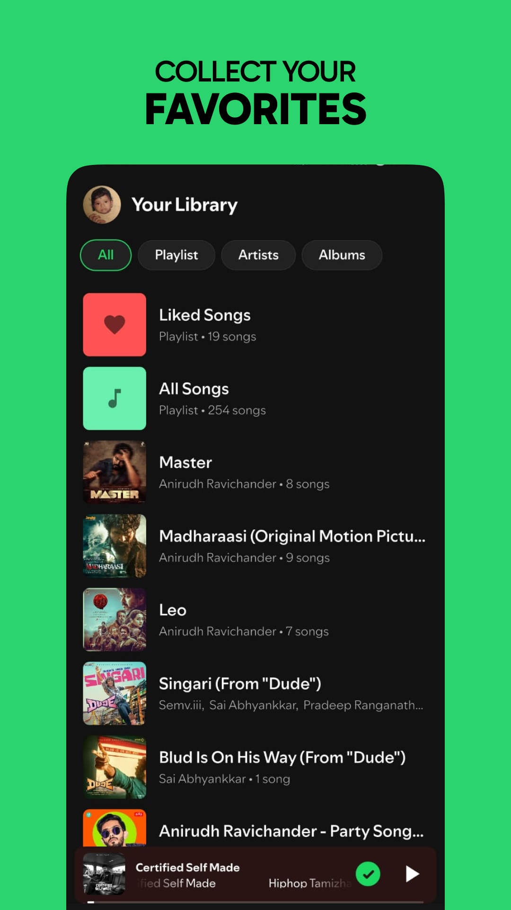

<h1 align="center">Hivefy 🎧</h1>

<p align="center">

  <!-- 🔹 GitHub Downloads -->
  <a href="https://github.com/Harish-Srinivas-07/hivefy/releases/latest">
    
  </a>

  <!-- 🔹 SourceForge Downloads -->
  <a href="https://sourceforge.net/projects/hivefy/files/">
    
  </a>

  <!-- 🔹 GitHub Latest Release -->
  <a href="https://github.com/Harish-Srinivas-07/hivefy/releases/latest">
    
  </a>
  <!-- 🔹 Built With / Platform / Open Source -->
  
  
  
</p>

**Hivefy** is a **FOSS, Spotify inpired, ad-free, and offline-ready music app** built with **Flutter** using the **unofficial JioSaavn API**.  
Explore trending charts, albums, playlists, and multi-language content — all **open-source, privacy-respecting, and fully customizable**. 🎵

<h3>Download for Android 😍</h3>

<!-- GitHub button -->
<p>
  <a href="https://github.com/Harish-Srinivas-07/hivefy/releases" target="_blank">
    
  </a>
</p>

<!-- SourceForge button -->
<p>
  <a href="https://sourceforge.net/projects/hivefy/" target="_blank">
    
  </a>
</p>

> ⚠️ Make sure “Install from unknown sources” is enabled in your device settings to install Hivefy.

## ✨ Features

### 🎨 Modern Experience

- Spotify-inspired **UI & animations**
- Dynamic **Material You theming**
- Adaptive icons and typography using **SpotifyMix**

### 🎧 Powerful Player

- Background playback via `audio_service`
- Swipe gestures & visual seek controls
- **Animated miniplayer → full player transition**

### 💾 Offline-First

- Download and store music locally (albums / playlists / songs)
- Automatic cleanup for invalid files
- Background download notifications

### 🔍 Smart Search & Library

- Unified global search (songs, albums, artists, playlists)
- Persistent library powered by **Hive DB**
- Works perfectly **without Internet**

### ⚙️ Settings & Customization

- Server selector (Main / Backup / Mirror)
- Cache management & download monitor
- Toggle theme, clear storage, and more

## 🖼️ Screenshots

<p align="center">
  
  
  
</p>
<p align="center">
  
  
</p>

## 🧠 Upcoming Features

- [ ] 🎼 Lyrics sync & overlay
- [ ] 🧠 AI-based recommendations
- [ ] ☁️ Cloud profile sync
- [ ] 🖥️ Windows app support
- [ ] 🍏 iOS app support
- [ ] 🤝 Playlist sharing & collaboration

---

## 🚀 Getting Started

### Prerequisites

- Flutter SDK **(>=3.7.2)**
- Android Studio / VS Code setup for Flutter
- Java JDK **17+** (for app signing)
- Device / emulator running **Android 7.0+**

### Setup & Run

```bash
git clone https://github.com/Harish-Srinivas-07/hivefy.git
cd hivefy
flutter pub get
flutter run
```

## 🧩 Tech Stack

| Category    | Packages                                                                           |
| ----------- | ---------------------------------------------------------------------------------- |
| **State**   | `flutter_riverpod`                                                                 |
| **Audio**   | `just_audio`, `audio_service`, `just_audio_background`                             |
| **Storage** | `hive`, `shared_preferences`, `path_provider`                                      |
| **UI/UX**   | `shimmer`, `cached_network_image`, `figma_squircle`, `flashy_tab_bar2`, `readmore` |
| **Network** | `dio`, `http`, `html_unescape`                                                     |
| **System**  | `flutter_local_notifications`, `disk_space_plus`, `package_info_plus`              |
| **Utils**   | `toastification`, `permission_handler`, `internet_connection_checker_plus`         |

## 💡 Developer Notes

- **Debug builds** use the `DebugServer` endpoint (no signing required)
- **Release builds** are automatically optimized with ProGuard
- All data models include `toJson` and `fromJson` with unescape normalization
- You can modify backend logic under `services/` and UI flows under `views/`

---

## ❤️ Contributing

We welcome PRs and ideas from everyone.
If you’d like to add a feature or fix a bug:

```bash
# Fork & branch
git checkout -b feature/my-awesome-feature

# Make changes
flutter pub get
flutter run
```

Then open a Pull Request — we’ll review it together 🎵

## ⚠️ Disclaimer

> Hivefy uses the **unofficial JioSaavn API** solely for educational and research purposes.
> The app **does not host or distribute** any copyrighted media.
> All rights belong to their respective owners.

## ⭐ Star the Repo

If Hivefy inspired you, show your support by starring ⭐ it on GitHub!
Let’s build the next generation of open music apps — **for everyone, ad-free**.
